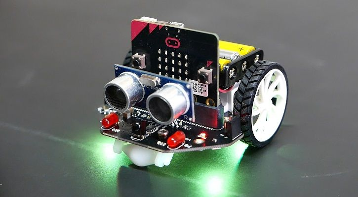
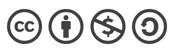

# Maqueen

## 0.-Introducción

# ¿QUÉ ES STEAM? ¿QUÉ ES MAQUEEN?

- El término STEAM surge de las siglas en inglés de: Science, Technology, Engineering, Arts & Mathematics. 
- Maqueen es un robot de programación gráfica para educación STEM diseñado para BBC micro: bit. Su chasis es plug and play y permite a los niños aprender rápidamente programación gráfica para entretener y fomentar el interés de los niños en la ciencia y el pensamiento lógico.

## [1.- Módulo1: Descripción y montaje](md/modulo1.md)

## [2.- Módulo2: Programación básica 1](md/modulo2.md)

## [3.- Módulo3: Programación básica 2](md/modulo3.md)

## [4.- Módulo4: Ampliación](md/modulo4.md)

## [5.- Proyecto](md/proyecto.md)

### Autores

- Manuel Moreno Neria
- Hugo Lucena Gutiérrez
- Daniel Ruiz Barrenas

## [Referencias](https://wiki.dfrobot.com/DFROBOT_EDUCATION)

### Licencia

